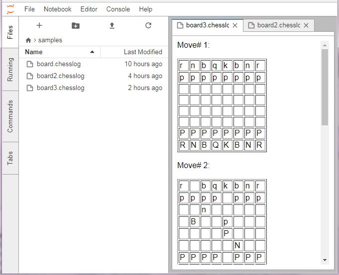

# chesslog-renderer

A JupyterLab extension for rendering [Forsyth–Edwards Notation](https://en.wikipedia.org/wiki/Forsyth%E2%80%93Edwards_Notation) to table. This repo uses [fen-chess-board](https://www.npmjs.com/package/fen-chess-board)



## Prerequisites

* [JupyterLab](https://github.com/jupyterlab/jupyterlab)

## Development

For a development install (requires npm version 4 or later), do the following in the repository directory:

```bash
npm install
jupyter labextension link .
```

To rebuild the package and the JupyterLab app:

```bash
npm run build
jupyter lab build
```

